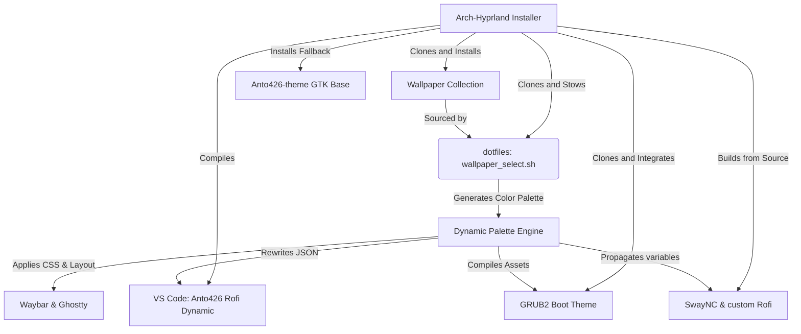

<p align="center">
  
</p>

<p align="center">
  <a href="https://git.io/typing-svg"></a>
</p>

<p align="center">
  
</p>

#  About the Ecosystem;

```sh
root@anto426: ~/organization (main⚡)$ neofetch

⡿⣡⣿⣿⡟⡼⡁⠁⣰⠂⡾⠉⢨⣿⠃⣿⡿⠍⣾⣟⢤⣿⢇⣿⢇⣿⣿⢿            root@anto426-org
⣱⣿⣿⡟⡐⣰⣧⡷⣿⣴⣧⣤⣼⣯⢸⡿⠁⣰⠟⢀⣼⠏⣲⠏⢸⣿⡟⣿            --------------------
⣿⣿⡟⠁⠄⠟⣁⠄⢡⣿⣿⣿⣿⣿⣿⣦⣼⢟⢀⡼⠃⡹⠃⡀⢸⡿⢸⣿            Ecosystem: Wayland / Hyprland
⣿⣿⠃⠄⢀⣾⠋⠓⢰⣿⣿⣿⣿⣿⣿⠿⣿⣿⣾⣅⢔⣕⡇⡇⡼⢁⣿⣿            Target OS: Arch Linux
⣿⡟⠄⠄⣾⣇⠷⣢⣿⣿⣿⣿⣿⣿⣿⣭⣀⡈⠙⢿⣿⣿⡇⡧⢁⣾⣿⣿            Color Engine: Dynamic Wallpaper Palette
⣿⡇⠄⣼⣿⣿⣿⣿⣿⣿⣿⣿⣿⣿⣿⠟⢻⠇⠄⠄⢿⣿⡇⢡⣾⣿⣿⣿            Primary Theme: Orchis Fork (Riva custom)
⣿⣷⢰⣿⣿⣾⣿⣿⣿⣿⣿⣿⣿⣿⣿⢰⣧⣀⡄⢀⠘⡿⣰⣿⣿⣿⣿⣿            Core Shell: Zsh + Oh My Posh
⢹⣿⢸⣿⣿⠟⠻⢿⣿⣿⣿⣿⣿⣿⣿⣶⣭⣉⣤⣿⢈⣼⣿⣿⣿⣿⣿⣿            Bootstrap Tool: GNU Stow + custom Installer
⢸⠇⡜⣿⡟⠄⠄⠄⠈⠙⣿⣿⣿⣿⣿⣿⣿⣿⠟⣱⣻⣿⣿⣿⣿⣿⠟⠁            VSCode Theme: Anto426 Rofi Dynamic
⠄⣰⡗⠹⣿⣄⠄⠄⠄⢀⣿⣿⣿⣿⣿⣿⠟⣅⣥⣿⣿⣿⣿⠿⠋⠄⠄⣾            Bootloader: Customized GRUB2
⠜⠋⢠⣷⢻⣿⣿⣶⣾⣿⣿⣿⣿⠿⣛⣥⣾⣿⠿⠟⠛⠉⠄⠄ . .
```

<p align="center">
  
</p>

#  Live Preview;

```sh
root@anto426: ~/organization (main⚡)$ preview --status

- 📽️ Watch Setup Demo: Playback player loaded below.
- 📸 Screenshot: Desktop environment rendered successfully below.
```

<p align="center">
  
</p>


<p align="center">
  
</p>

#  Core Repositories;

```sh
root@anto426: ~/organization (main⚡)$ btop --preset repos

+- core.installer                    -+     +- ecosystem.components              -+
| 1. Arch-Hyprland     [##########]   |     | 1. dotfiles          [##########]   |
|    - Beautiful Wayland Installer    |     |    - Configurations & Theming Engine |
| 2. auto-setup-LT     [######....]   |     | 2. rofi              [#########.]   |
|    - Shell & Terminal Bootstrap     |     |    - Wayland Slider Fork         |
|                                     |     | 3. grub2-themes      [########..]   |
|                                     |     |    - Dynamic Bootloader Theme    |
|                                     |     | 4. Anto426-theme     [#######...]   |
|                                     |     |    - GTK Stable Theme Base       |
|                                     |     | 5. vscodetheme       [######....]   |
|                                     |     |    - VSCode Palette Sync         |
|                                     |     | 6. Wallpaper-Coll.   [#####.....]   |
|                                     |     |    - Aesthetic Visual Assets     |
+-------------------------------------+     +-------------------------------------+

```

### 🔗 Repositories Directory
* 🚀 **[Arch-Hyprland](https://github.com/Arch-repo/Arch-Hyprland)** — Beautiful automatic Wayland setup installer.
* ⚡ **[auto-setup-LT](https://github.com/Arch-repo/auto-setup-LT)** — Minimal shell/terminal bootstrap script.
* 🌌 **[dotfiles](https://github.com/Arch-repo/dotfiles)** — Custom configuration files & dynamic theming engine.
* 🎛️ **[rofi](https://github.com/Arch-repo/rofi)** — Customized Wayland Rofi fork enabling slider controls.
* 🗂️ **[grub2-themes](https://github.com/Arch-repo/grub2-themes)** — Stylized bootloader theme synchronized with active wallpaper.
* 🖌️ **[Anto426-theme](https://github.com/Arch-repo/Anto426-theme)** — Orchis-based dark GTK fallback base theme.
* 🧩 **[vscodetheme](https://github.com/Arch-repo/vscodetheme)** — VS Code theme customized for Rofi engine integration.
* 🖼️ **[Wallpaper-Collection](https://github.com/Arch-repo/Wallpaper-Collection)** — High quality wallpapers & terminal assets.


<p align="center">
  
</p>

#  Architecture Flow;



<p align="center">
  
</p>

#  Visitors;

<p align="center">
  
</p>

<p align="center">
  
</p>

<div align="center">
  <i>Maintained by the anto426 ecosystem</i>
</div>
